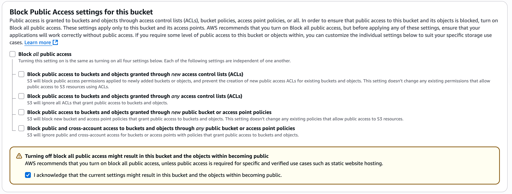
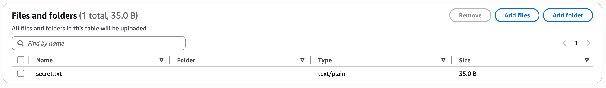
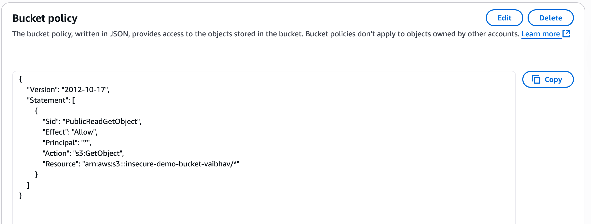
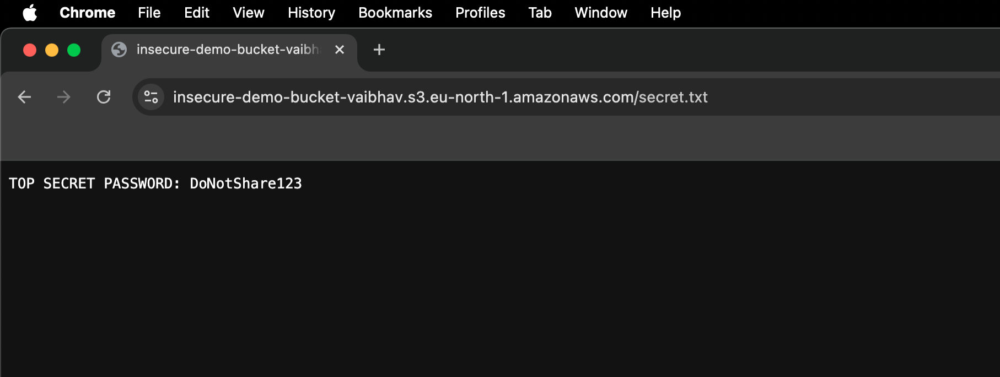
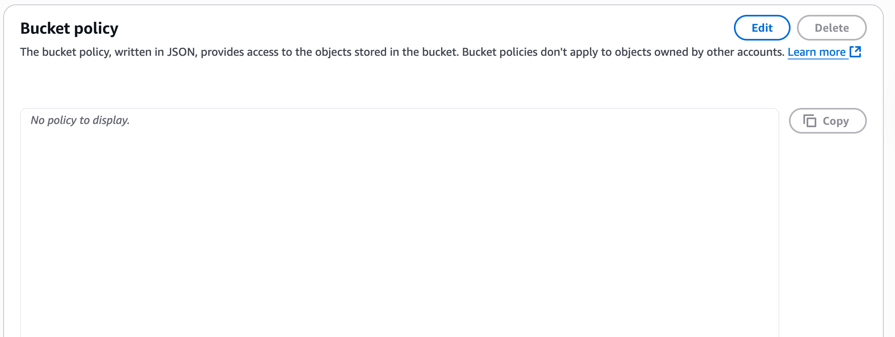
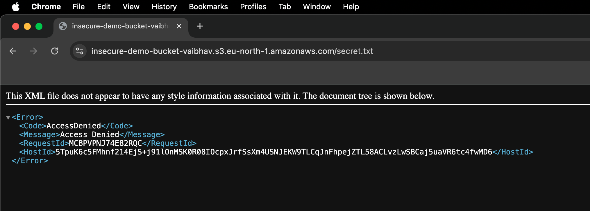
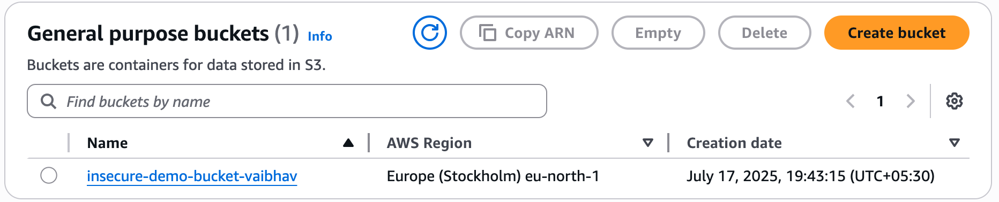

# ☁️ AWS S3 Public Bucket Misconfiguration Lab (Cloud Security Project)

This hands-on lab simulates a **real-world AWS S3 security misconfiguration**, where an S3 bucket is made public—exposing sensitive data to the internet. The project demonstrates both the **vulnerability** and the **remediation**, following best practices in cloud security.

---

## 📌 Scenario

An S3 bucket was configured with **public access** enabled. A sensitive file (`secret.txt`) containing fake credentials was uploaded. This file became accessible to **anyone on the internet** without authentication.

This simulates a common mistake made by developers or misconfigured CI/CD pipelines, and is frequently exploited in real-world breaches.

---

## 🛠️ Lab Steps

### 1. Create S3 Bucket with Public Misconfiguration

📸 Screenshot:  


---

### 2. Upload Sensitive File

📸 Screenshot:  


---

### 3. Apply Insecure Bucket Policy

```json
{
  "Version": "2012-10-17",
  "Statement": [
    {
      "Sid": "PublicReadGetObject",
      "Effect": "Allow",
      "Principal": "*",
      "Action": "s3:GetObject",
      "Resource": "arn:aws:s3:::insecure-demo-bucket-vaibhav/*"
    }
  ]
}
```

📸 Screenshot:  


---

### 4. Access File from Internet (No Login Required)

📸 Screenshot:  


---

## 🔐 Remediation

### 5. Remove Insecure Bucket Policy

📸 Screenshot:  


---

### 6. Validate Fix (Access Denied on Public Access)

📸 Screenshot:  


---

### 7. Final Bucket Overview in S3 Console

📸 Screenshot:  


---

## ✅ Lessons Learned

- ✅ Always enable **"Block All Public Access"** unless there's a clear use case.
- 🔐 Never store sensitive data in publicly accessible buckets.
- 📊 Use **S3 Access Analyzer** and **IAM policies** for secure permission management.
- 🧠 Misconfigurations like this have caused major real-world breaches (e.g., Uber, Accenture, FedEx).

---

## 🧠 What I Gained

- 💡 Real AWS S3 configuration and policy experience  
- 🔎 Understanding of public access controls vs IAM-based security  
- 🚨 Awareness of how misconfigurations can expose data  
- 🛠️ Practice in remediating cloud misconfigurations like a security analyst  

---

## 📁 Project Files

```
aws-s3-security-lab/
├── README.md
├── secret.txt
├── 00-bucket-public-setting.png
├── 01-upload-file.png
├── 02-bucket-policy-public.png
├── 03-public-access-browser.png
├── 04-bucket-policy-removed.png
├── 05-access-denied-browser.png
├── 06-bucket-list-view.png
```

---

## 🚀 Author

**Vaibhav S** — Aspiring Cloud & Cybersecurity Engineer  
📍 Bangalore, India  
🔗 [LinkedIn](https://linkedin.com/in/vaibhav-satish)
